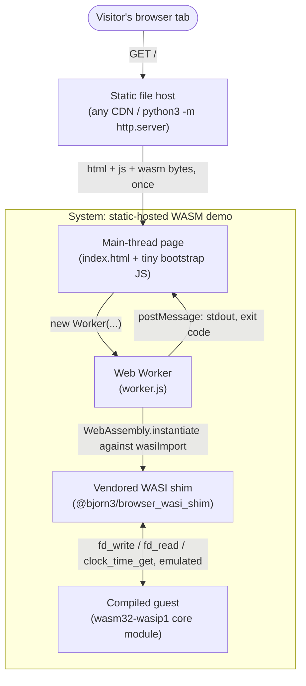

# Archetype: Browser Worker + Vendored WASI Shim

> Exemplified by: [experiment 004](../../experiments/004_static_wasi_hello/),
> [005](../../experiments/005_stdout_capture_load/),
> [006](../../experiments/006_worker_kill_switch/).
> This is `mvl-lang/mvl-playground`'s actual production architecture — 004 was
> built specifically to replicate it and measure it in isolation.

## System Context

A visitor loads a **static** web page — no backend process exists at request time,
no server-side compute of any kind. The page's own JavaScript spawns a Web Worker,
which loads a compiled `.wasm` module and runs it against a **JavaScript
emulation** of WASI, entirely inside the browser's own sandbox.

## Containers

| Container | Path | Role |
|-----------|------|------|
| Static host | any CDN, or `python3 -m http.server` in dev | Serves bytes once; does zero compute for the request lifecycle. Not "serverless" in the FaaS sense — genuinely *no server* after the initial GET. |
| Main-thread page | `web/index.html` | Bootstraps the Worker, receives results via `postMessage` |
| Web Worker | `web/worker.js` | Owns the `WebAssembly.instantiate` call and the WASI import object; runs on its own thread so it can be `.terminate()`d without freezing the tab |
| Vendored WASI shim | `@bjorn3/browser_wasi_shim`, vendored at build time (no CDN, no bundler) | A JS-side emulation of `wasi_snapshot_preview1` — `fd_write`/`fd_read`/`clock_time_get`/etc. implemented over JS objects, not real OS syscalls |
| Guest module | Rust compiled to **`wasm32-wasip1`** | Confirmed the *only* viable target: `wasm32-wasip2` output fails at `WebAssembly.compile()` itself (`expected version 01 00 00 00, found 0d 00 01 00`) — a parse-level rejection, one layer below the WASI-import question, because wasip2 emits the component-model binary format and a plain `WebAssembly.compile()` only accepts core modules |

## Verified facts, not assumptions

- **Entry point convention**: `worker.js` calls `wasi.start(instance)`, which wraps
  `_start`. This particular shim version **catches its own internal
  `WASIProcExit`** and returns the exit code rather than throwing it — confirmed by
  reading `dist/wasi.js` directly, not inferred from a stack trace (exp 004).
- **`file://` does not work.** Constructing a module Worker from a `file://` page
  fails with `origin 'null'` — a real static server (even a one-line dev one) is
  required for every experiment in this archetype (exp 004).
- **`SharedArrayBuffer` needs COOP/COEP headers**, which a plain
  `python3 -m http.server` does not send. Verified directly: `typeof
  SharedArrayBuffer` is `"undefined"` without them, becomes available once a
  custom `coi_server.py` adds `Cross-Origin-Opener-Policy: same-origin` /
  `Cross-Origin-Embedder-Policy: require-corp` (exp 006 — needed there for a
  cross-thread heartbeat via `Atomics`; **not** needed by 004/005, which don't use
  `SharedArrayBuffer` at all).

## Measured, not projected

| Metric | Value | Source |
|---|---|---|
| Cold start (10 runs, min / median / max) | 22.2 / 22.7 / 100.6 ms | exp 004. Run 1's 100.6ms outlier attributed to first-navigation JIT warmup, reported rather than dropped. |
| Artifact size | 39.4KB (`.wasm` alone), 85.6KB (full page, no bundler) | exp 004 |
| stdout/stderr capture, per-line cost at scale | 0.0425ms/line at N=10 → 0.0016ms/line at N=100,000 (**~26x decrease**, not constant as naively assumed) | exp 005 |
| DOM-append overhead at N=100,000 lines | ~780ms extra (**>3x**) vs. capturing without touching the DOM | exp 005 — worker-side WASM execution itself barely moves (315.9ms → 337.6ms); the cost is in `appendChild`, not the WASM |
| `Worker.terminate()` against a genuine infinite loop | **~2.137 seconds** to actually die (8 measurements, 2,134–2,138ms, ≤4ms spread), regardless of whether the loop allocates memory | exp 006 — refutes "close to instant"; the call itself returns in under a millisecond, but *execution continues* for ~2.1s after that |

## Constraints this archetype imposes

- Guest **must** target `wasm32-wasip1`. Not a preference — `wasm32-wasip2` is
  structurally incompatible with a plain `WebAssembly.compile()` call.
- No real stdin. A shim emulates WASI *syscalls*, not a terminal — console-driven,
  interactive programs (`read_line`-style loops) have nothing real to read from.
  See [ADR-0005](0005-archetype-embedded-runtime-library.md) for the archetype
  that actually solves this.
- `Worker.terminate()` is a real kill switch but not an instant one — a caller
  relying on it as a timeout mechanism needs a budget measured in seconds, not
  milliseconds, for CPU-bound guests.
- Shim correctness is now part of the trust boundary: WASI here is *emulated in
  JavaScript*, not backed by the OS. A shim bug is indistinguishable from a guest
  bug until proven otherwise.

## When this is the right shape

Zero-marginal-cost hosting (static files, no backend to run or pay for), and the
workload is either non-interactive (batch compute, one-shot transforms) or drives
its own UI directly rather than reading a console. This is exactly
`mvl-lang/mvl-playground`'s bet: ship the compiler's `--backend=wasm` output as a
static artifact, run it in a Worker, show the captured output. It stops being the
right shape the moment the guest needs `stdin` for real, or needs to run longer
than a few seconds under a caller that must be able to cancel it promptly.
