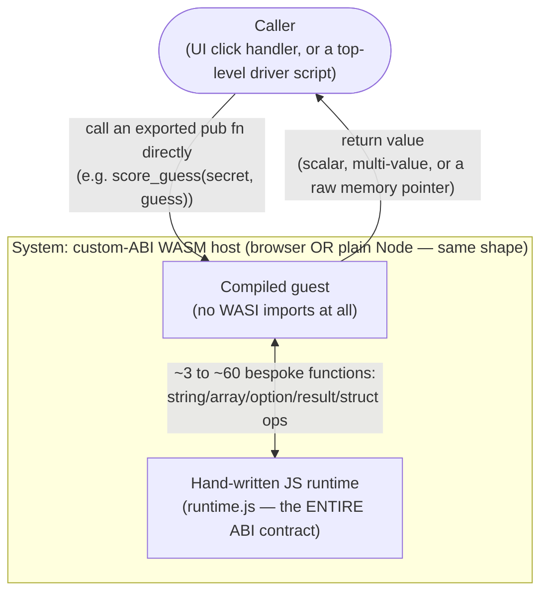

# Archetype: Custom Hand-Rolled Import Namespace (Non-WASI ABI)

> Exemplified by: [experiment 007](../../experiments/007_custom_runtime_vs_interpreter/)'s
> `custom_runtime` leg (minimal, 3-function version),
> [008](../../experiments/008_mvl_example_wasm_harness/) and
> [010](../../experiments/010_mastermind_web/) (MVL's real ~60-function version).

## System Context

Instead of targeting WASI at all, the compiler emits a **bespoke import
namespace** — a `WebAssembly.instantiate(bytes, { runtime: {...} })` call where
`runtime` is not a standard world, just whatever functions a hand-written JS
module chooses to implement. Portable to *any* JS host — this is the one
archetype in the repo proven to work identically in a browser (010) and in a bare
Node.js process (007, 008), because there's no WASI-shaped assumption (no Worker
requirement, no `file://` restriction) baked into it at all.

## Containers

| Container | Path | Role |
|-----------|------|------|
| Guest module | 007: Rust → `wasm32-unknown-unknown`. 008/010: MVL source → `mvl build --backend=wasm` | Zero WASI imports. All non-trivial operations (even string concatenation) are calls into the custom namespace. |
| Hand-written runtime | 007: 37 lines of JS. 008/010: `mvl-runtime.js`, a byte-faithful port of `mvl-lang/mvl-playground`'s own `web/src/runtime/mvl-runtime.ts` | This file **is** the ABI. There is no spec, no validator, no third party implementing this namespace anywhere else — it is exactly as correct as whoever wrote it made it. |
| Caller | 007: a Node script calling one exported function. 010: a UI click handler calling `score_guess()`/`color_name()` on demand, with no single "run" entry point at all | Decides when and how the guest's exports get invoked — this archetype has no equivalent of `_start`; a "library" module (010) may never run anything end-to-end, only answer individual function calls. |

## Two real shapes inside this one archetype

- **Command-style, hybrid** (008): the compiled module still has a `_start` and
  still needs *real* WASI for stdio (`wasi_snapshot_preview1.fd_write`) — the
  custom namespace only replaces data-structure operations, not I/O. Two import
  namespaces satisfied at once.
- **Pure library-style** (010): no `_start`, no I/O of any kind, no WASI import at
  all. The module is a portable, sandboxed collection of pure functions the host
  calls whenever it wants. Simplest and most decoupled of anything in this repo.

## The scale range is real, not incidental

| | Import surface | Artifact | Cold start | Hand-written host code |
|---|---|---|---|---|
| 007 (minimal) | 3 functions (`string_new`/`string_concat`/`string_write`) | **302 bytes** | **0.28ms** | 78 lines total (41 Rust + 37 JS) |
| 008/010 (MVL's real convention) | ~60 functions (string/array/option/result/map/struct ops) | varies by program | not benchmarked | `mvl-runtime.js`, ~340 lines |

007's minimal leg exists specifically to show the floor of this archetype: how
small can a "compile a program to WASM and run it" story get if you refuse both
WASI and an interpreter. 302 bytes and 0.28ms is the answer — compare against
[ADR-0006](0006-archetype-interpreter-in-wasm.md)'s 11.9–17.6MB and hundreds of
milliseconds for the same rough job done by shipping a language runtime instead.

## The real, demonstrated cost of this archetype

This is not a hypothetical trade-off — it happened, in this repo, this session.
`_mvl_struct_alloc`, `_mvl_array_get`, and every string-creating function in
`mvl-runtime.js` returned JS-side handle-table indices (small incrementing
integers), but the *compiled module itself* does raw `i64.store`/`i64.load`/
`i32.load` directly on those return values — confirmed by reading the actual WAT
body of `score_guess` (a struct-returning function) and of a `for x in [array
literal]` loop. A handle used as a raw memory address corrupts real module memory.

**One instance of this bug had already been misfiled as a compiler bug**
(`mvl-lang/mvl#2083`, "actor message routing crash") before being traced back to
this exact ABI boundary and corrected. There is no framework here to catch this
class of error — the entire memory-safety contract between guest and host is
whatever the hand-written `runtime.js` happens to get right. See
`experiments/008_mvl_example_wasm_harness/README.md` for the full writeup; this is
the archetype's central trade-off, not a footnote.

Also confirmed in exp010: **string-literal data can silently disappear.**
`mvl build --backend=wasm`'s dead-code elimination drops `(data ...)` segments for
string literals used only by `pub` functions never called from `main()` — the
function still exports correctly, its `i32.const <ptr>` instructions still look
right, they just point at nothing. Worked around with a small build-time patch
script rather than blocked by it; the underlying gap is still open (flagged
against `mvl-lang/mvl#2084`, not yet fixed upstream).

## When this is the right shape

The workload is small, self-contained, and doesn't need WASI's assumptions
(filesystem, real stdio, clock) — or a language's compiler doesn't target WASI at
all and inventing a minimal namespace is genuinely cheaper than adapting to one
that does. Library-style modules (010) that expose a handful of pure functions to
a UI are the strongest fit: no entry point ceremony, smallest possible surface.
Reach for a standard ABI instead ([ADR-0004](0004-archetype-prebuilt-server-http-blackbox.md)
or [ADR-0005](0005-archetype-embedded-runtime-library.md)) the moment correctness
at the memory boundary matters more than footprint — this archetype offers no
safety net for that boundary at all.
