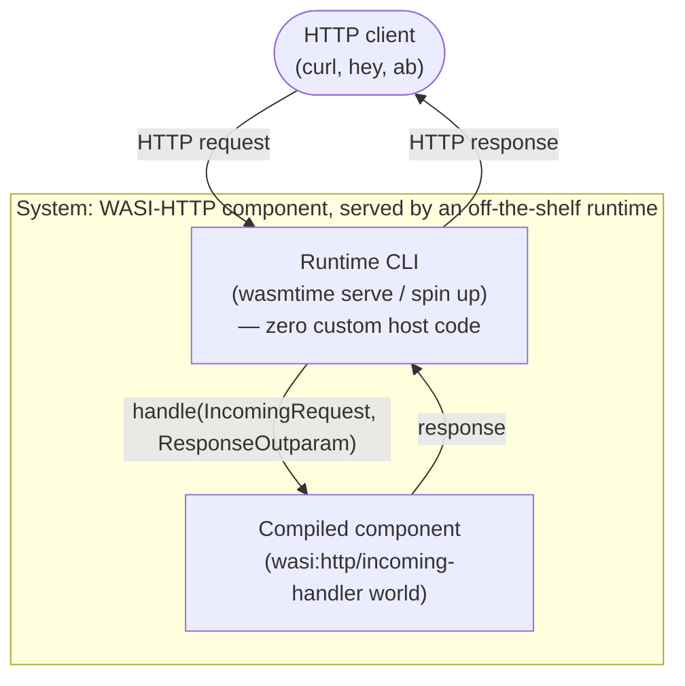

# Archetype: Pre-Built Server, Consumed as an HTTP Black Box

> Exemplified by: [experiment 001](../../experiments/001_hello_world/)'s leg 3
> (Rust, `wasmtime serve`), and [003](../../experiments/003_wasm_compile/)'s
> js-spin / py-raw / py-spin / rust / as-hello legs (`spin up` /
> `wasmtime serve`).

## System Context

An off-the-shelf CLI (`wasmtime serve`, `spin up`) **is** the entire host. There
is no custom host code at all — the CLI loads a compiled component and routes
HTTP requests to it directly. This is the most standardized shape in the repo:
any language with WASI-HTTP component tooling can fill the same box.



## Containers

| Container | Path | Role |
|-----------|------|------|
| Runtime CLI | `wasmtime serve --addr ...` (exp 001 leg3, 003's rust leg) or `spin up` (003's js-spin/py-spin legs) | The entire host process. Not written by this repo — a general-purpose tool. |
| Compiled component | one per language/toolchain (see below) | Implements `wasi:http/incoming-handler` — a real Component Model world, not preview1's flat ABI |

## Proven interchangeable across source languages

| Leg | Toolchain | Confirmed target |
|---|---|---|
| 001 leg3 / 003 rust | Rust | `wasm32-wasip2`, `wasi::http::proxy::export!(Component ...)` |
| 003 js-spin | JavaScript | Spin's `http-js` template, esbuild-bundled then componentized via `jco` |
| 003 py-raw | Python | `componentize-py` against a raw WIT world |
| 003 py-spin | Python | Spin's `http-py` template |
| 003 as-hello | AssemblyScript | `asc` + `wasm-tools` — present on disk, **not currently documented in 003's own README** (a real drift, flagged separately, not fixed as part of this ADR) |

Four different source languages, same host shape, same world. That interchangeability
is this archetype's whole reason to exist.

## The real, demonstrated risk: component-model version skew

Neither 001 nor 003 has measured numbers yet (both experiments are genuinely
"results pending" — every results table is a blank placeholder, reported
honestly rather than filled with guesses). But [experiment
007](../../experiments/007_custom_runtime_vs_interpreter/) attempted to reuse this
exact shape (its `componentize-py` leg, built in-place from 003's `python-raw/`)
and hit a live failure, not a hypothetical one:

```
component imports instance wasi:cli/environment@0.2.4,
but a matching implementation was not found in the linker
```

A genuine WASI-preview2 world-version mismatch between the installed `wasmtime`
and `componentize-py`'s generated bindings — a toolchain/environment gap, not a
defect in the component itself. A fallback attempt via `python-spin` hit a
*second*, independent gap: that directory has no `wit/` tracked at all. Both are
reported as-is in 007's README (including an explicit `N/A` in its results table
for the measurement that couldn't be taken) rather than papered over.

## Constraints this archetype imposes

- Guest must target a real Component Model world (`wasi:http/incoming-handler`),
  not preview1's flat ABI — a materially bigger lift than
  [ADR-0002](0002-archetype-browser-worker-wasi-shim.md)'s plain core module.
- The runtime CLI's own version and the guest toolchain's generated bindings must
  agree on a WASI-preview2 world version. 007 shows this is a real, current
  failure mode, not a solved problem.
- Every request pays full HTTP framing plus whatever the component-model
  canonical ABI costs to cross — there is no path to the microsecond-scale calls
  [ADR-0005](0005-archetype-embedded-runtime-library.md) measures, because HTTP
  and the CLI subprocess boundary are both mandatory parts of this shape.
- "Cold start" here includes the CLI subprocess's own startup, not just the
  guest's instantiation — a different, larger number than any Worker- or
  library-embedded archetype in this repo.

## When this is the right shape

Multiple teams/languages need to ship interchangeable HTTP handlers behind one
stable interface, and you want zero custom host code — any WASI-HTTP-compliant
runtime (Wasmtime, Spin, in principle wasmCloud/WasmEdge) can serve the same
artifact. It is the wrong shape for latency-sensitive in-process calls (see
[ADR-0005](0005-archetype-embedded-runtime-library.md) instead) and for anything
that must run with zero backend process at all (see
[ADR-0002](0002-archetype-browser-worker-wasi-shim.md)).
