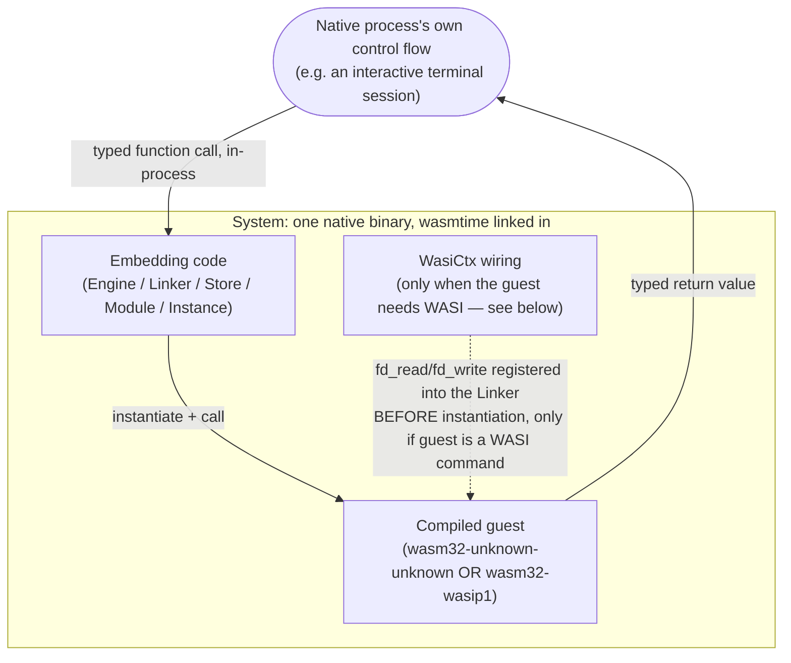

# Archetype: Embedded Runtime as a Library (In-Process, Native Host)

> Exemplified by: [experiment 009](../../experiments/009_rust_native_host/)
> (zero-import pure-compute guest) and
> [011](../../experiments/011_mastermind_cli_wasi/)'s `host/`
> (full WASI command guest, real interactive stdin).

## System Context

The host is itself a compiled native binary that **links the WASM engine as a
library** — no subprocess, no HTTP, no CLI boundary of any kind. The only
overhead is whatever WASM's own linear-memory ABI requires. This is the tightest
possible integration in the repo, and the only one where "real interactive stdin
under WASM" was proven end-to-end (011).

## Containers

| Container | Path | Role |
|-----------|------|------|
| Embedding host | 009: `host/src/main.rs`. 011: `host/src/main.rs` | A normal compiled Rust binary linking the `wasmtime` crate directly (`Engine`, `Module`, `Store`, `Instance`) |
| Guest, zero imports | 009: `guest/src/lib.rs`, `wasm32-unknown-unknown`, `#[no_mangle] extern "C" fn transform(i64) -> i64` | Nothing to wire — the entire point of this variant |
| Guest, full WASI command | 011: `guest/src/main.rs`, `wasm32-wasip1`, plain `std::io::stdin()` | Compiles straight through to real `fd_read` calls — no special handling on the guest side at all |
| WASI wiring (011 only) | `host/src/main.rs` | `wasmtime_wasi::preview1::add_to_linker_sync` + `WasiCtxBuilder::inherit_stdin/stdout/stderr` — about 10 lines, registered into the `Linker` *before* instantiation |

## The two sub-shapes are deliberately different

- **009 — nothing to wire.** A guest with zero imports needs no linker
  registration at all: `Instance::new(&mut store, module, &[])`. This is the floor
  of host complexity for this archetype.
- **011 — explicit WASI wiring.** The guest is a real WASI *command* (uses
  `std::io::stdin()`/`println!`), so the host must register `preview1`'s
  functions into a `Linker<WasiP1Ctx>` and build a `WasiCtx` with stdio
  `inherit_*`'d before instantiating, then call `_start` the same way `wasmtime
  run` does internally. This is the concrete answer to what
  [ADR-0002](0002-archetype-browser-worker-wasi-shim.md)'s browser Worker
  archetype cannot do: real interactive stdin isn't a WASM/WASI limitation, it's
  a question of whether the host actually wires `fd_read` to something real.
  **Verified genuinely interactive, not just a piped file**: a real pty
  (`pty.openpty()` + `select()` with a timeout) sending one line at a time
  confirmed the guest process actually *blocks* between prompts rather than
  having had a whole canned input file available all along.

## Measured, not projected

| Metric | Value | Source |
|---|---|---|
| True cold start, first launch (external wall-clock via `time`, includes OS process launch) | **190ms** | exp 009 |
| True cold start, second launch (OS file cache now warm) | **4ms** | exp 009 — the ~186ms gap on first launch is the OS loading cold pages, invisible to any timer started *inside* the process |
| Warm-loop call, first iteration | 64–172µs (varies by run, includes first-call JIT lag) | exp 009 |
| Warm-loop call, remaining 999 iterations | median 9–15µs, min 8–13µs, max 18–101µs | exp 009 |

**The warm-loop number needs its caveat stated, not just its headline quoted.**
A Medium article claiming "~200µs average" for a comparable Go+`wazero`
architecture is beaten here by roughly 13x — but two real, separate reasons, not
one: (1) different engines/languages — `wasmtime` (Cranelift-JIT, zero FFI/cgo tax
since host and engine are both Rust) vs. `wazero` (a pure-Go reimplementation, a
different and younger compiler pipeline); (2) **this benchmark's payload does
zero data marshalling** — `transform(i64) -> i64`, no memory access at all — while
the article's own workload crosses the boundary with real bytes (`malloc`, write
into WASM memory, call, read back out). [ADR-0003](0003-archetype-custom-hand-rolled-abi.md)'s
handle-based string marshalling already shows that cost is real and not free.
This number isolates pure call overhead, not realistic call-with-data overhead —
presenting it as an unqualified "Rust beats Go by 13x" would be dishonest.

## Constraints this archetype imposes

- The host is no longer "ship a script, run anywhere" — it's a compiled, deployed
  native binary with a real build/release story of its own.
- If the guest needs WASI, the host must wire it explicitly — there is no
  ambient environment providing it, unlike a real terminal running a native
  program directly.
- Everything is in-process: a guest fault is a fault in your host process too
  (no subprocess/HTTP boundary absorbing it) unless you deliberately sandbox
  further (Wasmtime's own memory isolation still applies at the WASM level, but
  there's no OS-process isolation between host and guest here).

## When this is the right shape

Latency-sensitive, high-frequency calls where µs-scale overhead actually matters,
or — uniquely among this repo's archetypes — a program that needs **real**
interactive I/O under WASM. The cost is giving up the deployment simplicity of a
static page ([ADR-0002](0002-archetype-browser-worker-wasi-shim.md)) or an
off-the-shelf server CLI ([ADR-0004](0004-archetype-prebuilt-server-http-blackbox.md))
for a bespoke native binary you now own end to end.
