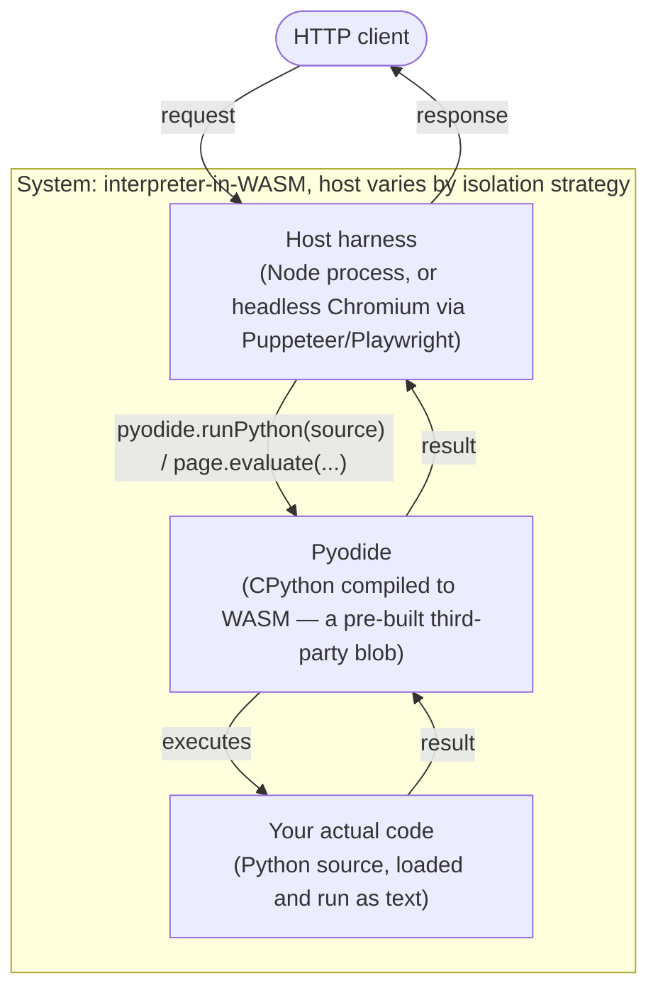

# Archetype: Interpreter-in-WASM (Ship the Runtime, Not the Program)

> Exemplified by: [experiment 001](../../experiments/001_hello_world/)'s legs
> 2a/2b/2c, [002](../../experiments/002_chromium_sandbox/)'s full 8-leg matrix,
> and [007](../../experiments/007_custom_runtime_vs_interpreter/)'s Pyodide leg
> (reusing 001's leg2a in place).

## System Context

The compiled `.wasm` is not your program — it's an entire **language runtime**
(Pyodide: CPython compiled to WASM). Your actual code is source text, fed to the
interpreter *at request time*, and never itself crosses a WASM import boundary.
This is the only archetype in the repo where the guest/host ABI question doesn't
really apply, because there's no compile-your-program-to-WASM step at all.

## Containers

| Container | Path | Role |
|-----------|------|------|
| Host harness | 001 leg2a: plain Node.js. 001 leg2b/2c, 002: headless Chromium (Puppeteer or Playwright) | Loads Pyodide (from disk or CDN) and feeds it source; for the browser variants, Node's own harness is itself an HTTP server the browser page talks to |
| Pyodide | pre-built, not compiled by this repo | CPython + stdlib, compiled to WASM once by the Pyodide project |
| Your code | plain `.py` source/modules | Interpreted, not compiled to WASM at all |

## The real subject of this archetype: isolation strategy, not the interpreter itself

Since the interpreter is a fixed, pre-built cost, this archetype's interesting
findings are all about **how you isolate concurrent requests** against it — that
is [experiment 002](../../experiments/002_chromium_sandbox/)'s entire scope, a
2×4 matrix of {workload} × {shared page vs. isolated/pooled contexts}:

| Comparison | Cold start | RSS | Warm p50 | Throughput |
|---|---|---|---|---|
| Shared page vs. fresh `BrowserContext`/request (CPU-bound) | 2,257ms vs 5,583ms | 593MB vs 1,791MB | 1.0ms vs 1.3ms | 920 vs 2,922 req/s (**3.2x**, fresh contexts win here — parallelism) |
| Shared page vs. fresh context (JSON transform) | 1,685ms vs 1,659ms | 586MB vs 350MB | 0.6ms vs **946ms** | 1,604 vs 1 req/s (**fresh context is ~1,600x slower** — Pyodide reload dominates) |
| Shared page vs. fresh context (DB query) | 1,790ms vs 1,619ms | 595MB vs 330MB | 1.1ms vs 982ms | 697 vs 1 req/s |
| Naive vs. pooled (mixed workload) | 1,805ms vs 5,627ms | 594MB vs 1,451MB | 1.5ms vs 2.4ms | 554 vs 1,455 req/s (**2.6x**, pooling recovers throughput) |

All figures are exp 002's own measured numbers, not projections. The pattern is
consistent: a **fresh** Pyodide instance per request is catastrophic (it has to
reload CPython from scratch — hence "~1,600x slower" on the JSON-transform
comparison), but a **pool** of warm instances recovers most of the throughput —
at a real, measured memory cost: **5 pooled `BrowserContext`s use ~1.7GB total
(~340MB/context, not the ~50MB/context a naive estimate assumed)**, an explicit
refutation logged in exp 002's own results, not a rounding footnote.

## Weight, compared directly against the cheapest alternative in this repo

| | Artifact | Cold start |
|---|---|---|
| Pyodide (this archetype) | **11.9MB** (core + stdlib zip) | 845ms |
| [ADR-0003](0003-archetype-custom-hand-rolled-abi.md)'s minimal custom-ABI leg, same rough job | **302 bytes** | 0.28ms |

Exp 007's own phrase for the size delta: **"~39,000x smaller"**. This is the
sharpest trade-off in the whole repo, stated plainly rather than softened: shipping
a full language runtime buys you zero-compile-step arbitrary source execution, at
a cost measured in megabytes and hundreds of milliseconds, versus bytes and
fractions of a millisecond for a purpose-compiled guest.

## Constraints this archetype imposes

- Cold start and artifact size are dominated by the interpreter, not by your
  program — optimizing your own code barely moves either number.
- Concurrency needs deliberate pooling; the naive "one instance per request"
  approach is not a scaling strategy, it's the slowest option measured (~1,600x in
  the worst case here).
- Pooling itself has a real, fixed memory floor (~340MB/context measured, not a
  smaller number someone might assume) — a capacity-planning input, not
  something to guess at.

## When this is the right shape

You need to run arbitrary/dynamic source you don't control at build time, or a
compile-to-WASM toolchain for your language genuinely doesn't exist or isn't
worth building. It is the wrong shape whenever the actual program is known ahead
of time and could instead be compiled directly — every other archetype in this
repo beats it on artifact size and cold start by one to several orders of
magnitude for that case.
