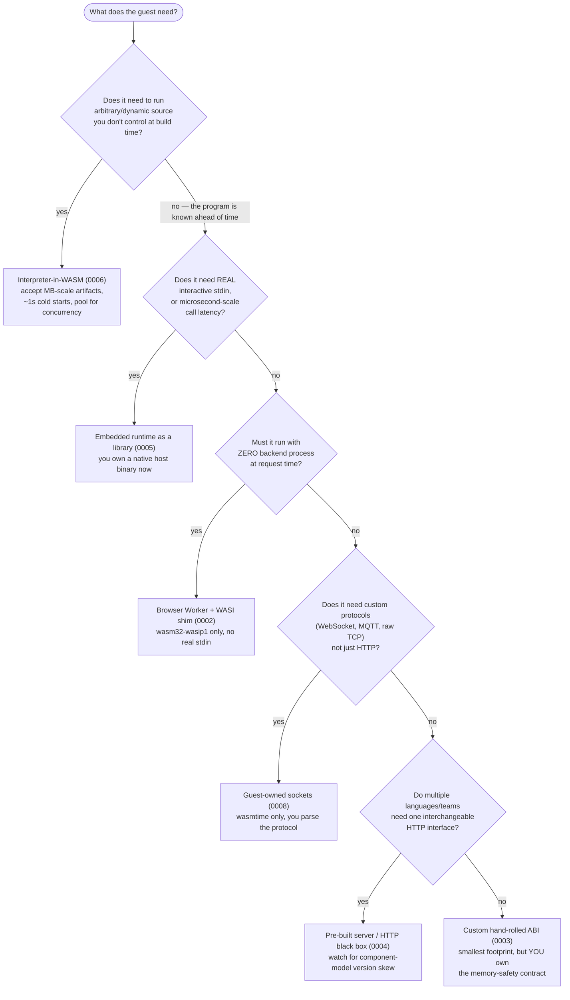

# Decision Guide: Choosing Among the Six Archetypes

> Synthesizes [ADR-0002](0002-archetype-browser-worker-wasi-shim.md) through
> [ADR-0006](0006-archetype-interpreter-in-wasm.md), plus
> [ADR-0008](0008-archetype-guest-owned-sockets.md). Every number below is cited
> in its own archetype ADR, traceable to a specific experiment's README — nothing
> here is a new measurement.

## The six, in one table

| Archetype | ADR | Host | Guest target | Real stdin? | Cheapest measured artifact | Cheapest measured cold start |
|---|---|---|---|---|---|---|
| Browser Worker + WASI shim | [0002](0002-archetype-browser-worker-wasi-shim.md) | Static page + Web Worker | `wasm32-wasip1` | No (emulated syscalls, no terminal) | 39.4KB | 22.7ms (median) |
| Custom hand-rolled ABI | [0003](0003-archetype-custom-hand-rolled-abi.md) | Any JS host (browser or Node, same shape) | `wasm32-unknown-unknown` | No — 008 wires WASI for stdout/stderr only | **302 bytes** | **0.28ms** |
| Pre-built server / HTTP black box | [0004](0004-archetype-prebuilt-server-http-blackbox.md) | `wasmtime serve` / `spin up` (off-the-shelf) | `wasi:http/incoming-handler` component | N/A (HTTP, not a terminal) | not yet measured (001/003 both "results pending") | not yet measured |
| Embedded runtime as a library | [0005](0005-archetype-embedded-runtime-library.md) | Native binary linking `wasmtime` | `wasm32-unknown-unknown` or `wasm32-wasip1` | **Yes — the only archetype proven genuinely interactive** | N/A (not artifact-size focused) | 4ms warm-cache / 190ms true cold |
| Interpreter-in-WASM | [0006](0006-archetype-interpreter-in-wasm.md) | Node, or headless Chromium | N/A — ships CPython, not your program | No (source, not a terminal session) | 11.9MB | 845ms |
| Guest-owned sockets | [0008](0008-archetype-guest-owned-sockets.md) | `wasmtime run --wasi inherit-network` | `wasm32-wasip2` + `wasi:sockets` | N/A (TCP server) | not yet measured (014 pending) | not yet measured |

## All experiments, mapped

| # | Name | Archetype(s) |
|---|---|---|
| 001 | hello_world | Leg1: plain container (control, not WASM). Leg2a/2b/2c: [0006](0006-archetype-interpreter-in-wasm.md). Leg3/4c: [0004](0004-archetype-prebuilt-server-http-blackbox.md). Leg4a: control. Leg4b: 0006 variant with a DB bridge. |
| 002 | chromium_sandbox | [0006](0006-archetype-interpreter-in-wasm.md) — the isolation-strategy deep dive |
| 003 | wasm_compile | [0004](0004-archetype-prebuilt-server-http-blackbox.md), all 5 legs (js-spin, py-raw, py-spin, rust, as-hello) |
| 004 | static_wasi_hello | [0002](0002-archetype-browser-worker-wasi-shim.md) |
| 005 | stdout_capture_load | [0002](0002-archetype-browser-worker-wasi-shim.md) |
| 006 | worker_kill_switch | [0002](0002-archetype-browser-worker-wasi-shim.md) |
| 007 | custom_runtime_vs_interpreter | `custom_runtime` leg: [0003](0003-archetype-custom-hand-rolled-abi.md). `componentize-py` leg: [0004](0004-archetype-prebuilt-server-http-blackbox.md) (failed — version skew, reported honestly). Pyodide leg: [0006](0006-archetype-interpreter-in-wasm.md) |
| 009 | rust_native_host | [0005](0005-archetype-embedded-runtime-library.md) — zero-import variant |
| 010 | mastermind_web | [0003](0003-archetype-custom-hand-rolled-abi.md) — pure library variant |
| 011 | mastermind_cli_wasi | [0005](0005-archetype-embedded-runtime-library.md) — full WASI command variant |
| 012 | stdlib_size_matrix | N/A — measurement utility |
| 013 | unicode_strategies | N/A — measurement utility |
| 014 | wasm_webserver | Leg A: [0008](0008-archetype-guest-owned-sockets.md). Leg B: [0004](0004-archetype-prebuilt-server-http-blackbox.md) |

## Decision flow

## The one cross-cutting lesson: the boundary layer matters

Every archetype puts a **boundary layer** between guest WASM and host — this is
where data crosses: strings, structs, function calls. Someone has to implement
that boundary correctly, and that someone varies by archetype:

| Archetype | Who implements the boundary | Who tests it |
|-----------|----------------------------|--------------|
| 0002 (Browser WASI shim) | Browser vendor / @aspect-build | They do |
| 0003 (Custom ABI) | **You** | **You do** |
| 0004 (Spin/wasmtime serve) | Bytecode Alliance | They do |
| 0005 (Embedded wasmtime) | wasmtime crate | They do |
| 0006 (Interpreter) | Pyodide / language runtime | They do |
| 0008 (Guest sockets) | wasmtime + wasi:sockets | They do |

**Why this matters: we found real bugs at this boundary.**

Testing a custom ABI (archetype 0003) surfaced three
memory-safety bugs in the hand-written JavaScript↔WASM marshalling code:

1. **Handle vs pointer confusion**: The JS runtime returned handle-table indices
   (small integers), but the guest module used them as raw memory addresses.
   This corrupts linear memory silently.

2. **Misfiled as a compiler bug**: One crash was initially blamed on the
   compiler's code generation. It was actually a bug in the boundary layer —
   the runtime's `_struct_alloc` function.

3. **Silent data disappearance**: String literal data was dropped by dead-code
   elimination when functions weren't called from `main()`. The boundary layer
   didn't validate that data segments existed.

These bugs shipped in what appeared to be working code. There was no framework
to catch them — the entire memory-safety contract was "whatever the hand-written
runtime.js happened to get right."

**The takeaway**: If you choose archetype 0003 (custom ABI), you own the
boundary layer. You test it. You debug it. You fix the memory corruption bugs.
The other archetypes delegate that responsibility to teams who specialize in it.
This isn't a reason to avoid 0003 — it's the smallest, fastest option — but it's
a reason to understand what you're signing up for.

See [ADR-0003](0003-archetype-custom-hand-rolled-abi.md) for the full details
of these bugs and how they were found.
