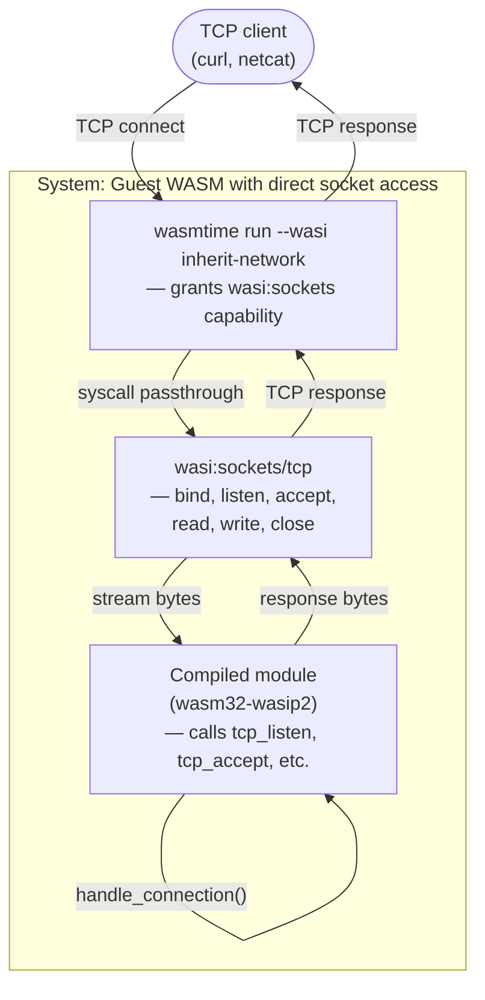

# Archetype: Guest-Owned Sockets via wasi:sockets

> Exemplified by: [experiment 014](../../experiments/014_wasm_webserver/)'s leg A
> (Rust, `wasm32-wasip2` + `wasi:sockets`, `wasmtime run --wasi inherit-network`).

## System Context

The guest WASM module owns the entire network lifecycle: bind, listen, accept,
read, write. The host runtime (wasmtime) provides the `wasi:sockets` capability
but does not manage connections itself. This is the opposite of
[ADR-0004](0004-archetype-prebuilt-server-http-blackbox.md)'s HTTP black box
model — there, the host owns the socket; here, the guest does.



## Containers

| Container | Path | Role |
|-----------|------|------|
| Runtime | `wasmtime run --wasi inherit-network` | Grants `wasi:sockets` capability, forwards syscalls |
| Guest module | `wasm32-wasip2` target, uses `std::net` | Owns the accept loop, parses requests, writes responses |

## How it differs from existing archetypes

| Aspect | Guest-owned sockets (this) | HTTP black box (0004) | Embedded library (0005) |
|--------|---------------------------|----------------------|------------------------|
| Who owns the socket | Guest | Host (Spin/wasmtime serve) | Host (native binary) |
| Protocol | Raw TCP (guest implements HTTP) | HTTP (host parses) | Whatever host exposes |
| Guest complexity | Higher (socket + HTTP code) | Lower (handler only) | Lowest (pure function) |
| Portability | wasmtime only (wasi:sockets) | Spin, wasmtime serve, Workers, etc. | Native binary only |
| Flexibility | Full (custom protocols, WS) | HTTP only | Full |

## Constraints this archetype imposes

- **Limited runtime support.** `wasi:sockets` is preview2 and still maturing.
  Spin doesn't expose it (uses `wasi:http` instead). Cloudflare Workers doesn't
  have it. Only wasmtime with `--wasi inherit-network` is proven to work.

- **Security surface.** The guest can bind arbitrary ports, make outbound
  connections, etc. The host must trust the guest or sandbox network access.

- **No HTTP framework.** The guest must implement HTTP parsing itself (or pull
  in a crate). This adds code size and complexity vs. 0004's handler-only model.

- **Single-threaded accept loop.** WASM has no threads; the accept loop blocks.
  For concurrency, you'd need `wasi:io/poll` or multiple instances behind a
  load balancer.

## When this is the right shape

- **Custom protocols.** WebSocket servers, MQTT brokers, Redis-compatible
  caches — anything that isn't HTTP request/response.

- **Learning / demonstration.** Proves WASM can do real networking, not just
  HTTP handlers. Useful for understanding the capability model.

- **Migration path.** If you have an existing TCP server in Rust, porting to
  `wasm32-wasip2` with `std::net` is mechanical — then decide later whether to
  refactor to `wasi:http` for broader deployment.

**This is NOT the right shape for:**

- Production HTTP services (use [0004](0004-archetype-prebuilt-server-http-blackbox.md))
- Edge deployment (Cloudflare, Fastly — no wasi:sockets)
- Minimal artifact size (HTTP parsing adds bloat)

## Relation to ADR-0004

Both target `wasm32-wasip2`. Both can serve HTTP. The difference is *who owns
the socket*:

```
                        ┌──────────────────┐
                        │  HTTP request    │
                        └────────┬─────────┘
                                 │
         ┌───────────────────────┼───────────────────────┐
         │                       │                       │
         ▼                       ▼                       ▼
   0004: Host                 014-A: Guest            014-B: Host
   (Spin/wasmtime serve)      (wasi:sockets)          (same as 0004)
   parses HTTP,               parses HTTP,            parses HTTP,
   calls handler()            handles connection()    calls handler()
```

014's leg A is this archetype. 014's leg B is 0004.

## Experiment 014 findings

_Pending benchmarks. This ADR will be updated with artifact size, cold start,
and throughput comparisons once both legs are measured._

## Open questions

1. **Does wasmtime's wasi:sockets work with TLS?** Not tested. Preview2 has
   no `wasi:tls` yet — TLS would require a Rust crate compiled to WASM or
   host-side termination.

2. **How does concurrency work?** `wasi:io/poll` exists but hasn't been
   tested in this repo. The single-threaded accept loop is a known limitation.

3. **Is there a path to Spin?** Spin could theoretically expose `wasi:sockets`
   as an opt-in capability. Not currently available.
